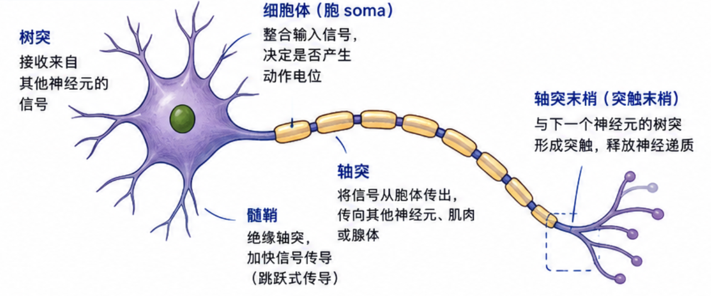
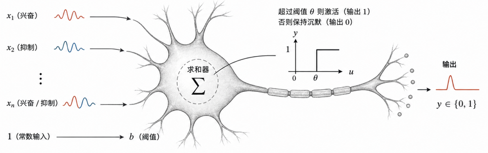
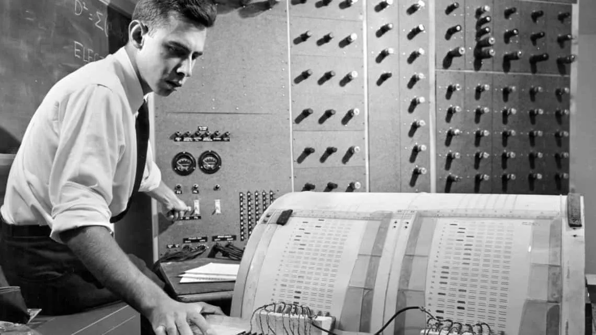
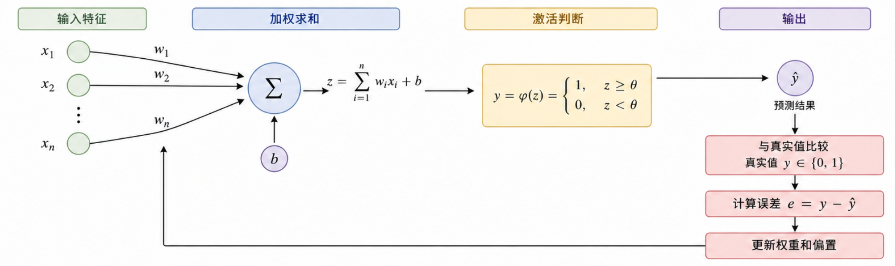
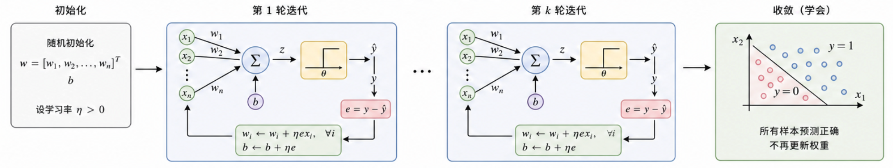
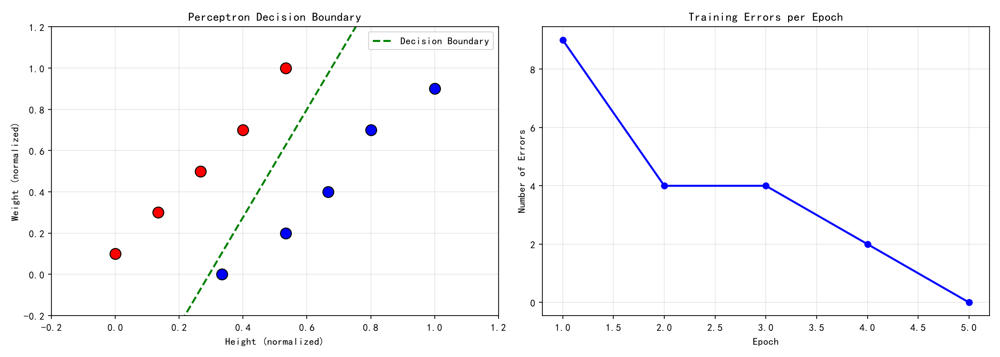
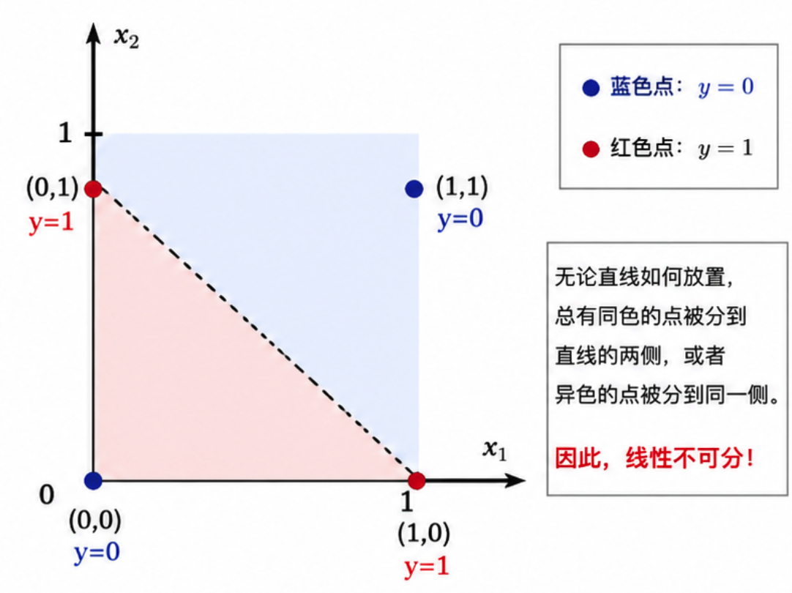

# 本节内容
1. 感知机简介与历史地位
2. 从生物到 M-P 神经元模型
3. 可学习权重的诞生
4. 感知机工作原理
5. 代码实战: 实现感知机
6. 训练与预测示例
7. 局限性历史与未来

# 感知机的定义
感知机  
- 其核心目标是完成分类任务
- 是通过自动寻找的决策边界，将输入的数据正确区分类别的机器  
- 是人类历史上**第一个真正落地的可学习机器方案**，让机器不再依赖人工规则，而是自动从数据中学习分类  
	
感知机诞生于 1957 年，结构精简完备，包含神经网络所有核心要素：
1. 输入
2. 权重
3. 求和
4. 激活
5. 误差反馈
6. 参数更新

通过了解感知机有助于掌握神经网络的完整架构，进而熟悉 CNN, RNN, Transformer 等后继框架。

# 感知机的思想起源
神经网络灵感来源于 **仿生学**，模拟生物大脑中神经元传递信息的过程。




## M-P 神经元 (1943)
1943 年，麦卡洛克 (McCulloch) 与 皮茨 (Pitts)  
联合发表 \<A Logical Calculus of the Ideas Immanent in Nervous Activity\>,   
通过数学公式描述生物神经元，即 M-P 神经元，奠定了人工神经网络的基础。



- 将生物神经元抽象为一个简单的 **逻辑单元**
- 同时接收多个兴奋信号或者抑制信号
- 当兴奋信号的总量超过某个阈值，激活神经元并输出信号，否则保持沉默

缺陷:   
- 仅是一个精巧的逻辑装置  
- 权重须由人工设定，机器本身无法学习  

## 赫布理论 (1949)
1949 年，心理学家 唐纳德·赫布 (Donald Olding Hebb)  
出版 《行为的组织》 指出  
- 如果两个神经元经常同时激活，那么它们间的连接会不断增强  
  反之不常同时激活，连接则会逐渐减弱
- **第一次从学习机制的角度解释神经连接的变化**
- 第一次对关键问题给出生物学依据—— **权重可以改变**

## 首台物理感知机 (1957)
1957 年，心理学家兼计算机科学家 弗兰克·罗森布拉特 (Frank Rosenblatt)  
发表论文 /<The Perceptron: A Perceiving and Recognizing Automaton/>  
同年在 IBM 704 计算机上完成了感知机的程序模拟 

对 M-P 模型的创新  
- 通过错误反馈自动调整权重  
- 机器每次做出错误预测，都会自动修正权重  



1958 年，他亲手制造真实的物理机器—— Mark I Perceptron 专门识别图像中的字母  

# 感知机的工作原理
感知机的工作原理简单：
1. 对输入特征做加权求和
2. 与阈值做比较完成判断
3. 根据错误反馈修正权重
4. 迭代学习直到正确分类



> qx2io:  
> 如果有机器学习的基础，会发现感知机的激活函数 (阶跃函数) 改成 Sigmoid 就是逻辑回归

虽然回看这个结构极其简单，但是它在早期首次将神经元模型、可变权重和错误驱动学习三者集合，构成一个真正自主学习的闭环系统。

## Step01 输入与加权
接收一组输入信号 $x_i$ ，每个输入代表数据的某个特征  
每个特征的重要性不尽相同，每个输入对应一个 **权重** $w_i$ ,  
权重大小代表对应特征对最终判断的影响程度  
- 权重越大的特征越关键
- 权重接近零的特征几乎可以忽略
- 呼应赫布理论 —— 连接越强，影响越大

## Step02 求和与判断
加权后求和得到 $z$ :  

$$
z = w_1 x_1 + w_2 x_2 + \ldots + b
$$

其中 $b$ 是偏执项 (Bias), 是对判断基准线的微调。  
得到 $z$ 之后进行激活判断，假设阈值为 0  

$$
\hat{y} = 
\begin{cases}
	1 & 若 z \ge 0 \\
	0 & 若 z < 0
\end{cases}
$$

- 如果 z 达到阈值，那么输出 1，在二分类问题中代表正类
- 如果 z 低于阈值，那么输出 0，在二分类问题中代表负类

至此，感知机已完成一次预测。  
之后，根绝错误反馈进行修正。  

## Step03 错误与修正
每次预测错误将以如下规则调整权重  



$$
w_i \leftarrow w_i + \eta \cdot (y - \hat{y}) \cdot x_i
$$

- $y$ : 实际正确答案
- $\hat{y}$ : 感知机的预测
- $(y - \hat{y})$ : 误差信号
- $x_i$ : 特征的输入值，误差按照输入值的大小分配责任
- $\eta$ : 学习率，控制每次调整的幅度

# 身材预测示例
判断身材偏胖或是偏瘦  

假设身材数据含有特征:  
- $x_1$ : 身高
- $x_2$ : 体重

流程如下  
1. 输入特征  
	- 收集数据  
	- 提取特征 $x_1$ 身高 $x_2$ 体重  
2. 处理数据  
	- 归一化，消除身高和体重的量级差异  
3. 目标标签  
	- 偏瘦记为 0  
	- 偏胖记为 1  
4. 训练过程  
	- 权重初始值为 0，让感知机对特征从一无所知开始  
	- 不断学习数据、输出预测、对比误差、修正权重  

> [!TIP]  
> 当感知机正确预测所有样本，即得完美“决策边界”

## 准备数据

```python
import numpy as np

# 原始数据：身高(cm)、体重(kg)
raw_data = np.array([
	[175, 71],   # 偏瘦
	[160, 63],   # 偏胖
	[172, 69],   # 偏瘦
	[162, 65],   # 偏胖
	[170, 66],   # 偏瘦
	[164, 67],   # 偏胖
	[168, 64],   # 偏瘦
	[166, 69],   # 偏胖
	[165, 62],   # 偏瘦
	[168, 72],   # 偏胖
])

# 标签：0=偏瘦，1=偏胖
labels = np.array([0, 1, 0, 1, 0, 1, 0, 1, 0, 1])
```

## 数据归一化

```python
# 计算每个特征的最小值和最大值
x_min = raw_data.min(axis=0)   # [160, 45]
x_max = raw_data.max(axis=0)   # [170, 85]

# Min-Max 归一化，把所有值压缩到 0~1
X = (raw_data - x_min) / (x_max - x_min)

# 打印归一化结果
for i in range(len(X)):
	print(f"样本{i+1}: 身高={X[i][0]:.3f}, 体重={X[i][1]:.3f}, 标签={labels[i]}")
```

```
样本1: 身高=1.000, 体重=0.900, 标签=0
样本2: 身高=0.000, 体重=0.100, 标签=1
样本3: 身高=0.800, 体重=0.700, 标签=0
样本4: 身高=0.133, 体重=0.300, 标签=1
样本5: 身高=0.667, 体重=0.400, 标签=0
样本6: 身高=0.267, 体重=0.500, 标签=1
样本7: 身高=0.533, 体重=0.200, 标签=0
样本8: 身高=0.400, 体重=0.700, 标签=1
样本9: 身高=0.333, 体重=0.000, 标签=0
样本10: 身高=0.533, 体重=1.000, 标签=1
```

## 定义感知机类
- `__init__` 设定超参数
- `fit` 是训练入口
- `weight` 初始值为0，使感知机对特征从一无所知开始训练
```python
class Perceptron:
	def __init__(self, learning_rate=1.0, n_iterations=100):
		self.lr = learning_rate             # 学习率 η
		self.n_iterations = n_iterations    # 最大训练轮数
		self.weights = None                 # 权重 w
		self.bias = None                    # 偏置 b
		self.errors_per_epoch = []          # 记录每轮错误数

	def fit(self, X, y):
		n_samples, n_features = X.shape

		# 权重和偏置全部初始化为 0
		self.weights = np.zeros(n_features)
		self.bias = 0
		self.errors_per_epoch = []

		for epoch in range(self.n_iterations):
			errors = 0  # 本轮错误计数

			for idx in range(n_samples):
				x_i = X[idx]
				y_true = y[idx]

				# ① 计算加权和：z = w1·x1 + w2·x2 + b
				z = np.dot(self.weights, x_i) + self.bias

				# ② 激活判断：z ≥ 0 输出 1，否则输出 0
				y_pred = 1 if z >= 0 else 0

				# ③ 计算误差
				error = y_true - y_pred

				# ④ 如果预测错误，更新权重和偏置
				if error != 0:
					self.weights += self.lr * error * x_i   # 更新权重
					self.bias += self.lr * error            # 更新偏置
					errors += 1                             # 错误计数
					print(f"第{epoch+1}轮，第{idx+1}个样本， 更新权重：{self.weights}, 更新偏置：{self.bias}")

			self.errors_per_epoch.append(errors)

			# 本轮零错误 → 收敛，训练结束
			if errors == 0:
				print(f"第{epoch+1}轮，错误数归零，训练收敛！")
				break

		return self

	def predict(self, X):
		# 计算加权和：z = w1·x1 + w2·x2 + b
		z = np.dot(X, self.weights) + self.bias
		
		# 激活判断：z ≥ 0 输出 1，否则输出 0
		return np.where(z >= 0, 1, 0)

```

## 开始训练
- `learning_rate` 学习率设为 0.5
- `n_iterations` 训练次数设为 100
- 调用 `fit` 开始训练，通过控制台打印每轮的权重变化
```python
model = Perceptron(learning_rate=0.5, n_iterations=100)
model.fit(X, labels)
```

```
第1轮，第1个样本， 更新权重：[-0.5  -0.45], 更新偏置：-0.5
...
第1轮，第10个样本， 更新权重：[-0.6   0.55], 更新偏置：0.5
第2轮，第1个样本， 更新权重：[-1.1  0.1], 更新偏置：0.0
...
第2轮，第10个样本， 更新权重：[-0.93333333  0.75      ], 更新偏置：0.5
第3轮，第1个样本， 更新权重：[-1.43333333  0.3       ], 更新偏置：0.0
...
第3轮，第10个样本， 更新权重：[-1.26666667  0.95      ], 更新偏置：0.5
第4轮，第1个样本， 更新权重：[-1.76666667  0.5       ], 更新偏置：0.0
第4轮，第4个样本， 更新权重：[-1.7   0.65], 更新偏置：0.5
第5轮，错误数归零，训练收敛！
```

## 验证预测
对所有的样本进行预测，校验结果
```python
predictions = model.predict(X)

for i in range(len(X)):
	true_label = "偏胖" if labels[i] == 1 else "偏瘦"
	pred_label = "偏胖" if predictions[i] == 1 else "偏瘦"
	status = "✅" if predictions[i] == labels[i] else "❌"
	print(f"样本{i+1}: 真实={true_label}, 预测={pred_label}  {status}")

print(f"\n最终参数：w1={model.weights[0]:.4f}, w2={model.weights[1]:.4f}, b={model.bias:.4f}")
```

```
样本1: 真实=偏瘦, 预测=偏瘦  ✅
样本2: 真实=偏胖, 预测=偏胖  ✅
样本3: 真实=偏瘦, 预测=偏瘦  ✅
样本4: 真实=偏胖, 预测=偏胖  ✅
样本5: 真实=偏瘦, 预测=偏瘦  ✅
样本6: 真实=偏胖, 预测=偏胖  ✅
样本7: 真实=偏瘦, 预测=偏瘦  ✅
样本8: 真实=偏胖, 预测=偏胖  ✅
样本9: 真实=偏瘦, 预测=偏瘦  ✅
样本10: 真实=偏胖, 预测=偏胖  ✅

最终参数：w1=-1.7000, w2=0.6500, b=0.5000
```

## 可视化

```python
import matplotlib.pyplot as plt
plt.rcParams['font.sans-serif'] = ['SimHei']
plt.rcParams['axes.unicode_minus'] = False

fig, axes = plt.subplots(1, 2, figsize = (14, 5))

# --- 左图: 数据点 + 决策边界 ---
ax = axes[0]

# 逐个绘制数据点 
for i in range(len(X)):
	# 蓝色 = 偏瘦(0)
	# 红色 = 偏瘦(1)
	color = 'blue' if labels[i] == 0 else 'red'
	ax.scatter(X[i][0], X[i][1], color = color, s = 120, edgecolors = 'black', zorder = 5)

# 绘制决策边界
## w1·x1 + w2·x2 + b = 0
## -> x2 = -(w1·x1 + b) / w2
w1, w2, b = model.weights[0], model.weights[1], model.bias
if w2 != 0:
	x1_line = np.linspace(-0.2, 1.2, 100)
	x2_line = -(w1 * x1_line + b) / w2
	ax.plot(x1_line, x2_line, 'g--', linewidth = 2, label = 'Decision Boundary')

ax.set_xlabel('Height (normalized)')
ax.set_ylabel('Weight (normalized)')
ax.set_title('Perceptron Decision Boundary')
ax.legend()
ax.grid(True, alpha = 0.3)
ax.set_xlim(-0.2, 1.2)
ax.set_ylim(-0.2, 1.2)

# --- 右图: 每轮错误数 ---
ax2 = axes[1]
ax2.plot(range(1, len(model.errors_per_epoch) + 1), model.errors_per_epoch, 'b-o', linewidth = 2)
ax2.set_xlabel('Epoch')
ax2.set_ylabel('Number of Errors')
ax2.set_title('Training Errors per Epoch')
ax2.grid(True, alpha = 0.3)

plt.tight_layout()
# plt.savefig('perceptron_result.png', dpi = 150)
plt.show()
```
经过若干轮训练后，感知机会得到一组合适参数，能够正确区分所有样本  
在二维平面区分"偏瘦"和"偏胖"的线，就是感知机的 **决策边界**



- 左图  
	展示感知机的"决策边界"  
	即区分偏胖和偏瘦的直线  
- 右图  
	展示每轮训练的错误数变化  
	直观看到模型逐渐将错误归零的学习过程  

# 感知机的局限

## 感知机的扬名 (1958)
1958 年，罗森布拉特 (Rosenblatt) 展示的 Mark I Perceptron  
能够自动学会识别图像，整个科学界为之震动  

> 《纽约时报》  
> 这是一台能够学习的电子计算机，是有史以来第一台能够像人脑一样认识、理解事物的机器


## 线性可分的局限
感知机只能解决 **线性可分** 的问题，然而现实中的数据常有非线性可分的  

设想一个复杂场景:  
同样的身高和体重，有人因为肌肉密度高显得精壮，有人脂肪率高显得虚胖  
单靠身高和体重这两个特征，已经难以通过一条直线正确区分所有情况。

逻辑运算中的 XOR (异或) 问题揭示了感知机的缺陷

XOR 规则  
- 输入相同时输出 0
- 输入不同时输出 1



由于 XOR 线性不可分，因此不存在直线将其完整区分

1969 年，MIT 的 马文·明斯基 (Marvin Minsky) 和 西摩·帕普特 (Seymour Papert)  
出版 《感知机》 (Perceptrons) 给出完整数学证明  
**感知机无法解决 XOR 这样的非线性问题，单层结构存在根本性的数学局限**

## 多层网络的可能
明斯基 (Minsky) 和 帕普特 (Papert) 只证明了单层网络的局限，但未证明多层网络无法被有效训练

鲜有留守的寒冬中，以 杰弗里·辛顿 (Geoffrey Hinton) 为代表的研究者们坚持探索，最终发现 **反向传播算法** (Back Propagation)
